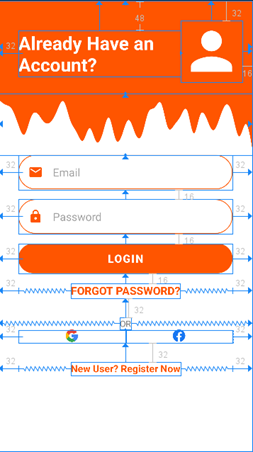
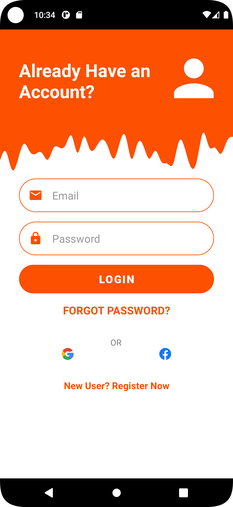
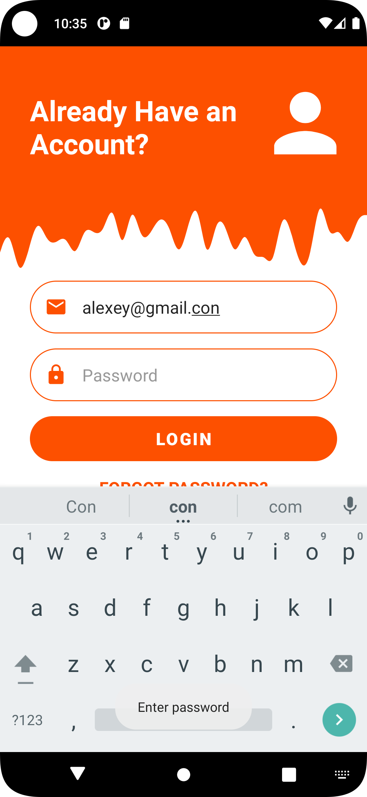
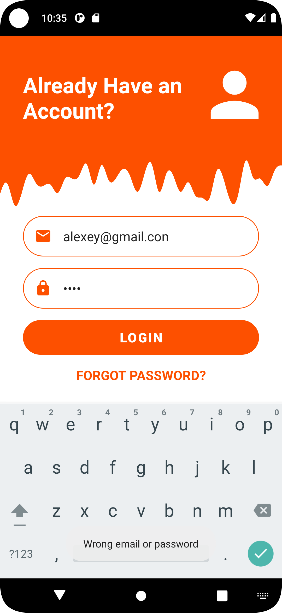
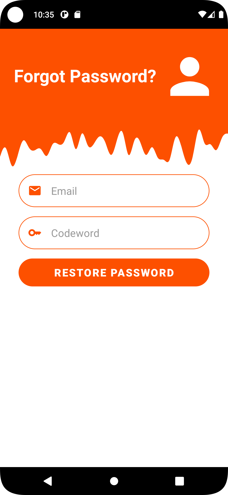
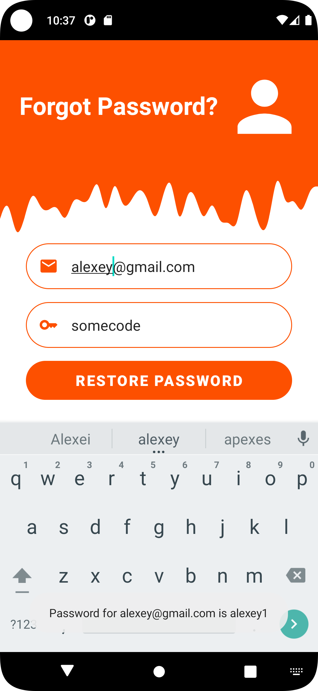

<p align = "center">МИНИСТЕРСТВО НАУКИ И ВЫСШЕГО ОБРАЗОВАНИЯ<br>
РОССИЙСКОЙ ФЕДЕРАЦИИ<br>
ФЕДЕРАЛЬНОЕ ГОСУДАРСТВЕННОЕ БЮДЖЕТНОЕ<br>
ОБРАЗОВАТЕЛЬНОЕ УЧРЕЖДЕНИЕ ВЫСШЕГО ОБРАЗОВАНИЯ<br>
«САХАЛИНСКИЙ ГОСУДАРСТВЕННЫЙ УНИВЕРСИТЕТ»</p>
<br><br><br><br><br><br>
<p align = "center">Институт естественных наук и техносферной безопасности<br>Кафедра информатики<br>Григораш Алексей Владимирович</p>
<br><br><br>
<p align = "center">Лабораторная работа № 9<br>«<strong>Создание интерфейсов 
с использованием макетов 
и виджетов
</strong>»<br>01.03.02 Прикладная математика и информатика</p>
<br><br><br><br><br><br><br><br><br><br><br><br>
<p align = "right">Научный руководитель<br>
Соболев Евгений Игоревич</p>
<br><br><br>
<p align = "center">г. Южно-Сахалинск<br>2023 г.</p>
<br><br><br><br><br><br><br><br>

## Введение:
**Android Studio** — интегрированная среда разработки производства Google, с помощью которой разработчикам становятся доступны инструменты для создания приложений на платформе Android OS


## Задачи:
**Упражнение. Сделать функциональный макет**

Необходимо реализовать макет по изображению, соблюдая отступы согласно рисунку 1. 

<div align="center">
    
    <p>Рисунок 1 – Прототип макета</p>
    
    <p>Рисунок 2 – Финальный макет</p>
</div>

Реализовать простую авторизацию по логину паролю, при удачной попытке вывести пользователю сообщение об авторизации, если пароль логин неверный, то сообщение об ошибке. 

Сделать вторую Activity для восстановления пароля в стилистике рисунка 1, также сделать переход с главной Activity на вторую.

## Решение:

### Email: alexey@gmail.com
### Password: alexey1 
### Codeword: somecode


<div align="center">
    
    
    
    
    
    
    
</div>


### MainActivity.kt:
```kt
package com.example.applab9


import android.content.Intent
import androidx.appcompat.app.AppCompatActivity
import android.os.Bundle
import android.widget.Button
import android.widget.EditText
import android.widget.TextView
import android.widget.Toast
import androidx.lifecycle.ViewModelProvider
import androidx.lifecycle.ViewModelProviders
import android.provider.ContactsContract.*
import android.provider.ContactsContract.CommonDataKinds.Email
import android.util.Patterns


class MainActivity : AppCompatActivity() {

    private lateinit var loginButton: Button
    private lateinit var emailTextEdit: EditText
    private lateinit var passwordTextEdit: EditText
    private lateinit var forgotPasswordTextView: TextView

    override fun onCreate(savedInstanceState: Bundle?) {
        super.onCreate(savedInstanceState)
        setContentView(R.layout.activity_main)

        val provider: ViewModelProvider = ViewModelProviders.of(this)
        val loginInfo = provider.get(LoginInfo::class.java)

        loginButton = findViewById(R.id.button_Login)
        emailTextEdit = findViewById(R.id.email_EditText)
        passwordTextEdit = findViewById(R.id.password_EditText)
        forgotPasswordTextView = findViewById(R.id.forgot_password)

        loginButton.setOnClickListener {
            val text = if (!loginInfo.emailCheck(emailTextEdit.text.toString())) "Enter correct email"
            else if (passwordTextEdit.text.toString().isEmpty()) "Enter password"
            else if (emailTextEdit.text.toString() == loginInfo.email && passwordTextEdit.text.toString() == loginInfo.password) "Logged In"
            else "Wrong email or password"

            if (text == "Logged In") this.startActivity(Intent(this, LoggedInActivity::class.java))
            else Toast.makeText(this, text, Toast.LENGTH_SHORT).show()
        }

        forgotPasswordTextView.setOnClickListener{
            this.startActivity(Intent(this, RestoreActivity::class.java))
        }
    }
}


```

### RestoreActivity.kt:
```kt
package com.example.applab9


import android.os.Bundle
import android.widget.Button
import android.widget.EditText
import android.widget.Toast
import androidx.appcompat.app.AppCompatActivity
import androidx.lifecycle.ViewModelProvider
import androidx.lifecycle.ViewModelProviders


class RestoreActivity : AppCompatActivity() {

    private lateinit var forgotEmailTextEdit: EditText
    private lateinit var codewordTextEdit: EditText
    private lateinit var restoreButton: Button

    override fun onCreate(savedInstanceState: Bundle?) {
        super.onCreate(savedInstanceState)
        setContentView(R.layout.activity_forgot)

        val provider: ViewModelProvider = ViewModelProviders.of(this)
        val loginInfo = provider.get(LoginInfo::class.java)

        forgotEmailTextEdit = findViewById(R.id.forgotEmail_textEdit)
        codewordTextEdit = findViewById(R.id.codeword_textEdit)
        restoreButton = findViewById(R.id.restore_button)

        restoreButton.setOnClickListener {
            val text = if (!loginInfo.emailCheck(forgotEmailTextEdit.text.toString())) "Enter correct email"
            else if (codewordTextEdit.text.toString().isEmpty()) "Enter codeword"
            else if (forgotEmailTextEdit.text.toString() == loginInfo.email && codewordTextEdit.text.toString() == loginInfo.codeword)
                "Password for ${loginInfo.email} is ${loginInfo.password}"
            else "Wrong email or codeword"

            Toast.makeText(this, text, Toast.LENGTH_LONG).show()
        }

    }

}
```
### LoggedInActivity.kt:
```kt
package com.example.applab9

import android.os.Bundle
import android.widget.TextView
import androidx.appcompat.app.AppCompatActivity
import androidx.lifecycle.ViewModelProvider
import androidx.lifecycle.ViewModelProviders

class LoggedInActivity : AppCompatActivity() {

    private lateinit var loggedinTextView: TextView

    override fun onCreate(savedInstanceState: Bundle?) {
        super.onCreate(savedInstanceState)
        setContentView(R.layout.activity_loggedin)

        val provider: ViewModelProvider = ViewModelProviders.of(this)
        val loginInfo = provider.get(LoginInfo::class.java)

        loggedinTextView = findViewById(R.id.loggedIn_TextView)
        loggedinTextView.text = "${loginInfo.email} Logged In"

    }

}
```

### LoginInfo.kt:
```kt
package com.example.applab9

import android.util.Patterns
import android.provider.ContactsContract.*
import android.provider.ContactsContract.CommonDataKinds.Email
import androidx.lifecycle.ViewModel

class LoginInfo : ViewModel() {

    var email = "alexey@gmail.com"
    var password = "alexey1"
    var codeword = "somecode"

    fun emailCheck(email: String) : Boolean = !email.isNullOrEmpty() && Patterns.EMAIL_ADDRESS.matcher(email).matches()
}
```
## Вывод:
В ходе выполнения задач реализовал макет и простую авторизацию по логину и паролю. Сделал вторую Activity для восстановления пароля, также сделал переход с главной Activity на вторую.